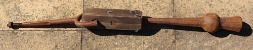
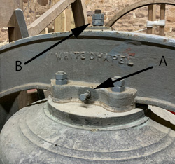

# Chapter 12: Inspection and Maintenance of Clappers

## Introduction

This chapter covers:

* [Background](#background): The various types of clappers, how they are made and suspended within the bell
* [Inspection of Clappers](#inspection-of-clappers): The ways in which clappers can be inspected, both as part of a routine maintenance schedule and to investigate any problems
* [Maintenance](#maintenance): The options for dealing with problems and the level of experience needed to carry them out
* [Final sections cover](#final-section-cover): Other Information relevant to clappers and Further Reading

> With very few exceptions, ringers do not own the bells.
> Permission must be obtained from the relevant authority before any work is carried out - see Permission to Carry out Work.

### Background

A clapper comprises four main components:

* The clapper ball, which strikes the bell
* The flight, which adds mass below the ball to move the centre of gravity nearer to the centre of percussion, reducing bending stresses where the shaft meets the ball
* The crown staple, from which the clapper is suspended
* The shaft, connecting the ball to the crown staple

#### Types of Clapper

There are three main types:

> Steel has been used to make clappers but these are not widely used and are not discussed further here.

* Traditionally, clappers were made from wrought iron.This is an iron alloy of low carbon content with slag inclusions which form a fibrous structure as the material is forged (or ‘wrought’) into a finished product. This material is tough, malleable, ductile, corrosion resistant and easily welded. It is an ideal material for producing a clapper. Unfortunately, it is now difficult to source.
* Faced with the difficulty of obtaining wrought iron, ductile iron - also known as spheroidal graphitic (or ‘SG’) cast iron - became the material of use for clappers. This is iron containing a high level of carbon (around 3%). Unlike the more familiar form of cast iron, where the carbon forms inclusions in the shape of flakes, ductile iron includes alloying elements which result in the carbon forming nodular inclusions, giving a tougher material. Being cast, rather than forged, the shape of the casting pattern is important.
* Since 2005, an increasing number of bells are now fitted with wooden shafted clappers. If well designed, these may improve the handling of ‘awkward’ bells and make it easier to raise large bells ‘right’ - see ‘Wooden Shafted Clappers’. ‘Composite clappers’ are also available: these use a man-made material for the shaft.

#### Clapper Suspension - Historical

> This section describes historical clapper designs to allow a steeple keeper to recognise them. The maintenance and repair of such clappers is a specialist task outside the scope of this document.

Up until the mid-19th century, clappers were suspended from a U-shaped wrought iron staple, cast into the crown of a bell during its manufacture. Iron corrodes with time and the corroded staple expands in the crown of the bell, generating stresses which will ultimately lead to cracking of the bell. For this reason. cast-in crown staples must be removed if the bell is to be retained for ringing - see [Removal of a cast-in crown staple](#removal-of-a-cast-in-crown-staple).

The clapper was usually suspended from a cast-in crown staple using a baldrick (or ‘baldric’) mechanism - essentially a leather strap. In the absence (or after the removal) of a cast-in crown staple, a separate bolt passed up through the crown of the bell and the headstock with the clapper suspended from a baldrick or using some wooden clamping mechanism.

|  |
|:--:|
| Fig C. Wrought iron clapper with Rudhall wooden top, removed from fourth bell at Thornbury, South Glos, during rehanging in 1996. (Photo: Robin Shipp) |

#### Modern Independent Clapper Assemblies

In modern installations, the clapper is suspended from an independent crown staple, as shown in [annotated photo], passing up through the crown of the bell and the headstock. Working down from the top, the component parts are:

* A fixing nut at the top of the headstock. There are several possibilities for this:
  * The most common is a castellated nut held in place with a split pin. Stainless steel split pins are preferred to avoid corrosion and they may need to be replaced after removal.
  * A plain nut with a split pin above - the nut may work loose but should not come off completely.
  * A nut plus a locknut - see Fig. A
  * A nut with a sacrificial plastic insert - this type must be replaced every time the nut is removed.
* Proprietary locking nuts with a metallic spring section that clamps to the thread.
* A steel washer between the nut and the top of the headstock.
* The part of the staple bolt within the headstock is normally of square section.
* Within the crown of the bell is the crown staple washer, made of leather or fibre. When the crown staple nut is tightened, this helps to lock the crown staple in position within the bell. This is particularly important where the inside of the crown of the bell is rough - for example where the bell has been quarter turned.
* At the bottom of the crown staple is a clevis fitting comprising a U-shaped yoke with a pivot pin supporting the clapper - described in the following section.

#### Pivot Pin and Clapper Bushes

The U-shaped clevis has two holes to accommodate a pivot pin. One hole and one end of the pin are threaded. After insertion, the threaded end of the pin protrudes through the clevis and is secured by a locknut - possibly a castellated one with a split pin. In most modern designs, the other end of the pin has a machined flat to allow an adjustable or C-spanner to hold the pin while the locknut is tightened. [Photo] This forms a ‘headless bolt’ to avoid stressing the clevis. If a bolt head is present, care must be taken not to overtighten as this could crack a cast staple or bend a steel one.

> Some designs of wooden shafted clappers have a ball bearing suspension. This is outside the scope of this document.

The top end of the clapper has a hole through which the pivot pin passes, lined with a bush. Various types of bush may be encountered:

Traditionally, clapper bushes were made of lignum vitae. This is a dense wood (it sinks in water) containing oils which provide some natural lubrication. It is ideal as a bearing material and has been used for bearings in hydro-electric plants and nuclear submarines. Unfortunately, the source trees are now regarded as ‘Near Threatened’ making further use of this material unsustainable. If worn lignum vitae bushes are encountered, they must be replaced - this is outside the scope of this document.
Clapper bushes made from lignum vitae required additional lubrication, either by a screw cap lubricator of the ‘Stauffer’ type or a grease nipple. Although more modern types of metal or plastic bushes may require no lubrication some bell hangers still provide grease nipples or similar. On balance, a method of lubrication is preferable but the benefit of retrospective fitting may be small.
Modern types of clapper bush are:
Oil impregnated sintered phosphor bronze bushes.
Nylon bushes were used but experienced the problem of swelling when damp or at elevated temperature. Such bushes are rarely fitted now but need not be replaced if performing satisfactorily. If necessary, the swelling problem can be rectified by careful reaming.
Clappers are commonly now fitted with bushes made from a thin TUFNOL tube backed by rubber. (TUFNOL is a proprietary laminated material impregnated with phenolic resin).

The top end of the clapper has a hole through which the pivot pin passes, lined with a bush. Various types of bush may be encountered:

* Traditionally, clapper bushes were made of lignum vitae. This is a dense wood (it sinks in water) containing oils which provide some natural lubrication. It is ideal as a bearing material and has been used for bearings in hydro-electric plants and nuclear submarines. Unfortunately, the source trees are now regarded as ‘Near Threatened’ making further use of this material unsustainable. If worn lignum vitae bushes are encountered, they must be replaced - this is outside the scope of this document.
* Clapper bushes made from lignum vitae required additional lubrication, either by a screw cap lubricator of the ‘Stauffer’ type or a grease nipple. Although more modern types of metal or plastic bushes may require no lubrication some bell hangers still provide grease nipples or similar. On balance, a method of lubrication is preferable but the benefit of retrospective fitting may be small.
* Modern types of clapper bush are:
  * Oil impregnated sintered phosphor bronze bushes.
  * Nylon bushes were used but experienced the problem of swelling when damp or at elevated temperature. Such bushes are rarely fitted now but need not be replaced if performing satisfactorily. If necessary, the swelling problem can be rectified by careful reaming.
  * Clappers are commonly now fitted with bushes made from a thin TUFNOL tube backed by rubber. (TUFNOL is a proprietary laminated material impregnated with phenolic resin).

####  Clapper Centring Pins (‘Twiddle Pins’)

While not strictly part of the clapper, it is appropriate to mention these here.

Most modern rings of bells with cast iron or fabricated steel headstocks have clapper centring pins fitted - usually known as ‘Twiddle Pins’. There is clearance where the crown staple passes through the bottom of the headstock and the crown of the bell and twiddle pins allow the crown staple to be positioned in the centre of the bell. There is a twiddle pin on either side of the headstock (see Fig. A), each pin comprising a bolt which locates against the generally square section of the staple. The crown staple can be positioned by slackening one pin and tightening the other. Locknuts on each pin allow the pins to be locked in place when the process is complete.

The use of twiddle pins to correct an odd-struck bell is described in [Odd-Struck Bells](odd-struck-bells).

|  |
|:--:|
| Fig A. Headstock of Tenor bell at Thornbury, South Glos, showing (A) ‘Twiddle Pin’ and (B) crown staple secured by a nut and locknut. (Photo: Robin Shipp) |

