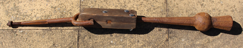

Chapter 12: Inspection and Maintenance of Clappers
==================================================

Introduction
------------

This chapter covers:

-   [Background](#background): The various types of clappers, how they
    are made and suspended within the bell
-   [Inspection of Clappers](#inspection-of-clappers): The ways in which
    clappers can be inspected, both as part of a routine maintenance
    schedule and to investigate any problems
-   [Maintenance](#maintenance): The options for dealing with problems
    and the level of experience needed to carry them out
-   [Final sections cover](#final-section-cover): Other Information
    relevant to clappers and Further Reading

> With very few exceptions, ringers do not own the bells. Permission
> must be obtained from the relevant authority before any work is
> carried out - see [Permission to Carry out
> Work](#permission-to-carry-out-work).

### Background

A clapper comprises four main components:

-   The clapper ball, which strikes the bell
-   The flight, which adds mass below the ball to move the centre of
    gravity nearer to the centre of percussion, reducing bending
    stresses where the shaft meets the ball
-   The crown staple, from which the clapper is suspended
-   The shaft, connecting the ball to the crown staple

#### Types of Clapper

There are three main types:

> Steel has been used to make clappers but these are not widely used and
> are not discussed further here.

-   Traditionally, clappers were made from wrought iron.This is an iron
    alloy of low carbon content with slag inclusions which form a
    fibrous structure as the material is forged (or 'wrought') into a
    finished product. This material is tough, malleable, ductile,
    corrosion resistant and easily welded. It is an ideal material for
    producing a clapper. Unfortunately, it is now difficult to source.
-   Faced with the difficulty of obtaining wrought iron, ductile iron -
    also known as spheroidal graphitic (or 'SG') cast iron - became the
    material of use for clappers. This is iron containing a high level
    of carbon (around 3%). Unlike the more familiar form of cast iron,
    where the carbon forms inclusions in the shape of flakes, ductile
    iron includes alloying elements which result in the carbon forming
    nodular inclusions, giving a tougher material. Being cast, rather
    than forged, the shape of the casting pattern is important.
-   Since 2005, an increasing number of bells are now fitted with wooden
    shafted clappers. If well designed, these may improve the handling
    of 'awkward' bells and make it easier to raise large bells 'right' -
    see 'Wooden Shafted Clappers'. 'Composite clappers' are also
    available: these use a man-made material for the shaft.

#### Clapper Suspension - Historical

> This section describes historical clapper designs to allow a steeple
> keeper to recognise them. The maintenance and repair of such clappers
> is a specialist task outside the scope of this document.

Up until the mid-19th century, clappers were suspended from a U-shaped
wrought iron staple, cast into the crown of a bell during its
manufacture. Iron corrodes with time and the corroded staple expands in
the crown of the bell, generating stresses which will ultimately lead to
cracking of the bell. For this reason. cast-in crown staples must be
removed if the bell is to be retained for ringing - see [Removal of a
cast-in crown staple](#removal-of-a-cast-in-crown-staple).

The clapper was usually suspended from a cast-in crown staple using a
baldrick (or 'baldric') mechanism - essentially a leather strap. In the
absence (or after the removal) of a cast-in crown staple, a separate
bolt passed up through the crown of the bell and the headstock with the
clapper suspended from a baldrick or using some wooden clamping
mechanism.

  -----------------------------------------------------------------------
                         
  -----------------------------------------------------------------------
     Fig C. Wrought iron clapper with Rudhall wooden top, removed from
  fourth bell at Thornbury, South Glos, during rehanging in 1996. (Photo:
                               Robin Shipp)

  -----------------------------------------------------------------------

#### Modern Independent Clapper Assemblies

In modern installations, the clapper is suspended from an independent
crown staple, as shown in \[annotated photo\], passing up through the
crown of the bell and the headstock. Working down from the top, the
component parts are:

-   A fixing nut at the top of the headstock. There are several
    possibilities for this:
    -   The most common is a castellated nut held in place with a split
        pin. Stainless steel split pins are preferred to avoid corrosion
        and they may need to be replaced after removal.
    -   A plain nut with a split pin above - the nut may work loose but
        should not come off completely.
    -   A nut plus a locknut - see Fig. A
    -   A nut with a sacrificial plastic insert - this type must be
        replaced every time the nut is removed.
-   Proprietary locking nuts with a metallic spring section that clamps
    to the thread.
-   A steel washer between the nut and the top of the headstock.
-   The part of the staple bolt within the headstock is normally of
    square section.
-   Within the crown of the bell is the crown staple washer, made of
    leather or fibre. When the crown staple nut is tightened, this helps
    to lock the crown staple in position within the bell. This is
    particularly important where the inside of the crown of the bell is
    rough - for example where the bell has been quarter turned.
-   At the bottom of the crown staple is a clevis fitting comprising a
    U-shaped yoke with a pivot pin supporting the clapper - described in
    the following section.

#### Pivot Pin and Clapper Bushes

The U-shaped clevis has two holes to accommodate a pivot pin. One hole
and one end of the pin are threaded. After insertion, the threaded end
of the pin protrudes through the clevis and is secured by a locknut -
possibly a castellated one with a split pin. In most modern designs, the
other end of the pin has a machined flat to allow an adjustable or
C-spanner to hold the pin while the locknut is tightened. \[Photo\] This
forms a 'headless bolt' to avoid stressing the clevis. If a bolt head is
present, care must be taken not to overtighten as this could crack a
cast staple or bend a steel one.

> Some designs of wooden shafted clappers have a ball bearing
> suspension. This is outside the scope of this document.

The top end of the clapper has a hole through which the pivot pin
passes, lined with a bush. Various types of bush may be encountered:

Traditionally, clapper bushes were made of lignum vitae. This is a dense
wood (it sinks in water) containing oils which provide some natural
lubrication. It is ideal as a bearing material and has been used for
bearings in hydro-electric plants and nuclear submarines. Unfortunately,
the source trees are now regarded as 'Near Threatened' making further
use of this material unsustainable. If worn lignum vitae bushes are
encountered, they must be replaced - this is outside the scope of this
document. Clapper bushes made from lignum vitae required additional
lubrication, either by a screw cap lubricator of the 'Stauffer' type or
a grease nipple. Although more modern types of metal or plastic bushes
may require no lubrication some bell hangers still provide grease
nipples or similar. On balance, a method of lubrication is preferable
but the benefit of retrospective fitting may be small. Modern types of
clapper bush are: Oil impregnated sintered phosphor bronze bushes. Nylon
bushes were used but experienced the problem of swelling when damp or at
elevated temperature. Such bushes are rarely fitted now but need not be
replaced if performing satisfactorily. If necessary, the swelling
problem can be rectified by careful reaming. Clappers are commonly now
fitted with bushes made from a thin TUFNOL tube backed by rubber.
(TUFNOL is a proprietary laminated material impregnated with phenolic
resin).

The top end of the clapper has a hole through which the pivot pin
passes, lined with a bush. Various types of bush may be encountered:

-   Traditionally, clapper bushes were made of lignum vitae. This is a
    dense wood (it sinks in water) containing oils which provide some
    natural lubrication. It is ideal as a bearing material and has been
    used for bearings in hydro-electric plants and nuclear submarines.
    Unfortunately, the source trees are now regarded as 'Near
    Threatened' making further use of this material unsustainable. If
    worn lignum vitae bushes are encountered, they must be replaced -
    this is outside the scope of this document.
-   Clapper bushes made from lignum vitae required additional
    lubrication, either by a screw cap lubricator of the 'Stauffer' type
    or a grease nipple. Although more modern types of metal or plastic
    bushes may require no lubrication some bell hangers still provide
    grease nipples or similar. On balance, a method of lubrication is
    preferable but the benefit of retrospective fitting may be small.
-   Modern types of clapper bush are:
    -   Oil impregnated sintered phosphor bronze bushes.
    -   Nylon bushes were used but experienced the problem of swelling
        when damp or at elevated temperature. Such bushes are rarely
        fitted now but need not be replaced if performing
        satisfactorily. If necessary, the swelling problem can be
        rectified by careful reaming.
    -   Clappers are commonly now fitted with bushes made from a thin
        TUFNOL tube backed by rubber. (TUFNOL is a proprietary laminated
        material impregnated with phenolic resin).

#### Clapper Centring Pins ('Twiddle Pins')

While not strictly part of the clapper, it is appropriate to mention
these here.

Most modern rings of bells with cast iron or fabricated steel headstocks
have clapper centring pins fitted - usually known as 'Twiddle Pins'.
There is clearance where the crown staple passes through the bottom of
the headstock and the crown of the bell and twiddle pins allow the crown
staple to be positioned in the centre of the bell. There is a twiddle
pin on either side of the headstock (see Fig. A), each pin comprising a
bolt which locates against the generally square section of the staple.
The crown staple can be positioned by slackening one pin and tightening
the other. Locknuts on each pin allow the pins to be locked in place
when the process is complete.

The use of twiddle pins to correct an odd-struck bell is described in
[Odd-Struck Bells](odd-struck-bells).

  -----------------------------------------------------------------------
                    
  -----------------------------------------------------------------------
   Fig A. Headstock of Tenor bell at Thornbury, South Glos, showing (A)
     'Twiddle Pin' and (B) crown staple secured by a nut and locknut.
                           (Photo: Robin Shipp)

  -----------------------------------------------------------------------

### Inspection of Clappers

This Section deals with initial and regular inspections of clappers.
Routine inspection and maintenance should be carried out in accordance
with a schedule - see Maintenance Schedule - and results of all
inspections, including issues raised and how they were resolved, should
be recorded.

For both practical and safety reasons, the inspection and any subsequent
maintenance must be carried out by at least two people, taking account
of Health & Safety Requirements. The Lead Inspector should have a
knowledge of the construction of clappers, as set out earlier, and
should have demonstrated competence by carrying out at least one
inspection under the supervision of an experienced Inspector. The
inspections described here can be carried out by a local Inspector and
helpers on the more modern independent crown staple designs; inspections
on the older types of clapper suspension may require assistance from
more experienced personnel.

The procedure for inspection is as follows:

1.  Standing in the pit, swing the clapper to check for squealing or
    grinding noises. It should swing smoothly and noiselessly. If not,
    this could indicate problems with the clapper bush. If the clapper
    has provision for lubrication this should be used.
2.  Check the clapper is swinging 'true' - that is, the axes of rotation
    of the bell and the clapper are parallel. This can be checked by
    loosely holding the clapper vertical while an assistant swings the
    bell through a small angle. If the clapper is not true it will move
    slightly sideways as the bell swings. Correction of this problem is
    described in Clapper not swinging true.
3.  If this is a first inspection, assess the extent of the clapper
    impact area on the inside of the bell. If elongated this indicates
    wear of the clapper bush.
4.  If the bell has a wooden clapper, this is a good time to check the
    tightness of the bolts securing the shaft to the clapper ball and
    the top fitting.
5.  Check the movement of the clapper by attempting to lift the clapper
    vertically while an assistant holds the crown staple nut lightly (if
    twiddle pins are present, slacken one of them first). On a
    well-maintained bell, there should be no vertical movement of the
    crown staple nut.
6.  There are two main reasons why movement might occur:

-   The nut may have worked loose. This is unlikely with a castellated
    nut and split pin or a proprietary type of locknut but might occur
    with other types of nut. The corrective action is described in
    Correcting loose crown staple nut.
-   The crown staple washer may be damaged.

7.  With the crown staple tight in the crown of the bell, there may
    still be some small vertical movement arising from play in the
    clapper bush. This can be investigated further by checking the
    sideways movement of the clapper - sometimes termed 'clapper roll'.
    This is a sensitive measurement as a small movement in the bush is
    magnified by the length of the clapper. Clapper roll is measured
    most easily by standing in front of the bell with the clapper pulled
    to touch the rim. The total extent (left to right) of sideways
    movement can then be measured. The amount of roll should be checked
    at each inspection to provide a history of bush wear and to give
    warning of the need for re-bushing. As a guide, clapper roll over
    20mm is warning of a need to plan for re-bushing and over 50mm
    requires immediate attention. A sudden large increase in clapper
    roll may indicate breakage of the pivot pin.

> If the bells have not been inspected for a long time, wear of the bush
> will be revealed by an elongated impact area on the bell

It will be necessary to remove the clapper to investigate (a) noise from
the swinging clapper, (b) excessive clapper roll, or (c) possible damage
to the crown staple washer or pivot pin - clapper removal is described
in Removal and replacement of a clapper.

### Maintenance

> When working under small bells it may be necessary to remove the
> slider (if present) to provide better access. You MUST check it has
> been replaced correctly when the work is complete.

#### Removal of a cast-in crown staple

Removal of a cast-in crown staple must be carried out by a professional
bell hanger, commonly within their workshop. Note that this work will
require a faculty (see [Permission to Carry out
Work](#permission-to-carry-out-work)).

#### Clapper not swinging true

The procedure is:

1.  Slacken off one twiddle pin if present
2.  Assistant just slackens the crown staple nut
3.  Inspector (in the bell pit) pulls the clapper to the side of the
    bell and rotates it to the central position
4.  Inspector loosely holds the clapper vertical and checks for sideways
    movement as assistant swings the bell through a small angle
5.  Repeat steps 3 and 4 until the Inspector is satisfied that the
    clapper is swinging true
6.  Inspector holds the clapper in the correct position against the edge
    of the bell while the assistant tightens the crown staple nut and,
    if fitted, the twiddle pin
7.  Repeat step 4 to check that the clapper is still swinging true -
    over-enthusiastic re-tightening of the crown staple nut may rotate
    the crown staple.

Record a note to check again at the next inspection interval. The
clapper will need removal for further investigation if the problem
recurs.

#### Correcting loose crown staple nut

As in replacement of the clapper described below.

#### Removal and replacement of a clapper

> Using local effort to remove and replace a clapper is valuable, since
> it saves a bell hanger the time and expense of travel to do this small
> part of the work.

Removal and replacement of a clapper is within the capability of an
average steeple keeper, even if rectification of any problems require
specialist services.

1.  If necessary, remove the split pin. Slightly loosen the crown staple
    nut, ideally using the correct size spanner, although a large
    adjustable spanner is a possible alternative. This may require some
    effort if the nut was over-tightened in the past.
2.  If twiddle pins are present, slacken one.
3.  Using tape or a marker pen, mark the ground pulley side of the
    clapper and the crown staple. This is to ensure that the clapper is
    replaced in the original orientation.
4.  An assistant stands in the pit ready to support the clapper while
    the Inspector removes the crown staple nut. The Inspector must warn
    the assistant just before the nut comes off the thread. The nut and
    washer are replaced for safe keeping on the crown staple after
    removal.

With the assembly removed, any problems with a worn bush, failure of a
pivot pin or a damaged washer will usually be obvious. Any problems can
be rectified either by a local engineering specialist or a bell hanger.

Replacement of the clapper follows the reverse procedure, ensuring that:

1.  The clapper is replaced in the original orientation, checking it is
    swinging true - see above
2.  The twiddle pin, if present, is tightened. This is done with the
    crown staple nut just tight ('nipped up' seems to be the technical
    term)
3.  The crown staple nut is tightened. A rule of thumb is to use only a
    moderate force applied to a 10\" (25cm) spanner.
4.  A final check is carried out to ensure the clapper is swinging true

Finally, details of the work carried out are recorded for future
reference.

### Other Information

#### Odd-Struck Bells

Ideally, the time it takes for a bell to strike after being pulled off
at handstroke should be equal to the time at backstroke. Many ringers
will have visited towers where they are warned that a certain bell is "a
bit slow at handstroke" or something similar. But this should not be the
case for a modern bell with the clapper hanging in the centre of the
bell at rest.

A bell that is noticeably odd-struck and has twiddle pins can be
corrected as follows:

1.  With the bell down, pull up the rope and secure it to take the
    weight of the rope off the wheel. The bell should now be at bottom
    dead centre of its rotation. If possible, check this with a straight
    edge and a spirit level across the mouth of the bell. (A bell on
    plain bearings may need nudging for it to settle at bottom dead
    centre.)
2.  Slightly loosen the crown staple nut.
3.  Standing facing the bell, touch the end of a tape measure against
    the striking surface on the clapper ball (taking care not to move
    the clapper) and read the measurement to the lip of the bell.
4.  Repeat this on the opposite side (it helps to have one person on
    each side).
5.  If the readings are different, slacken one twiddle pin and tighten
    the other.
6.  Repeat steps 3 to 5 until the two measurements are equal, ideally to
    within 1mm.
7.  Re-tighten the crown staple nut and re-instate the bell rope.

If twiddle pins are not present, the recommendation is to place a
tapered washer (or a half-washer) under the crown of the bell. But this
is outside the scope of this document.

Electronic devices are available for measuring odd-struckness - as
described in [Odd-struckness and Swing
Periods](#odd-struckness-and-swing-periods). It may be possible to find
someone able to offer this as a service - perhaps in your local Guild or
Association. Such a device can offer useful data on the swing periods of
bells and the comparison between all bells in the ring - see also in
[Odd-struckness and Swing Periods](#odd-struckness-and-swing-periods).
While outside the scope of this document, this may be worth
investigating as a way of dealing with problems in striking for some
rings of bells.

#### Clapper Breakage

A broken clapper (see Fig. B) is not something that a local steeple
keeper can deal with. The failure usually results from a fatigue crack
initiated from a surface or internal defect. It is to be hoped that such
failures may become less common with better designs of SG clappers.

                   
  ----------------------------------------------------------
   Fig B. SG clapper broken at top end. (Photo: Dave Clark)

The steeple keeper can play a part by removing the remains of the broken
clapper and by installing the new or repaired one.

> In the event of a broken clapper, the steeple keeper must check all
> parts of the installation for any consequential damage caused by the
> flying clapper.

#### Worn Clapper Ball

Wear on the striking face of the clapper ball should be checked during
routine maintenance. If a substantial flat surface has developed this is
a job for a bell hanger, although the steeple keeper can assist by
removing and replacing the clapper. The bell hanger may be able to twist
and re-forge the shaft of a wrought iron clapper to present a new
striking face.

#### Bell going up Wrong

Some bells are prone to going up 'wrong'. That is, the clapper is on the
lower (wrong) side of the bell when it is set at handstroke after
raising. For some bells, it may be difficult to set the bell when this
occurs. This depends on the design of bell and clapper - more
specifically, on (a) the distance between the two axes of rotation of
bell and clapper, and (b) the low amplitude swing periods of the bell
and clapper. As a rough guide, the low amplitude swing period of the
clapper should be at least 90% that of the bell.

Rectification is a job for specialists, although replacement with a
wooden shafted clapper may help.

### Further Reading

#### Permission to Carry out Work

For towers within the jurisdiction of the Church of England, the
churchwardens and the Parochial Church Council are responsible for the
maintenance of the tower and bells. Their consent should be obtained for
all work on the bell installation and they must obtain a Faculty where
appropriate. The latest (2019) Faculty Jurisdiction Rules are available
online [here](http://www.legislation.gov.uk/uksi/2019/1184/made). See
also the Stewardship & Management Guidance Note: Backhurst, R and Hodge,
A. Changes to the Church of England Faculty Jurisdiction Rules - A Guide
for Bell Ringers (2020), available online
[here](https://cccbr.org.uk/wp-content/uploads/2020/08/SM_Faculty_Changes_2020_Ver_1.pdf).

Different arrangements will apply in other jurisdictions within the UK
and world-wide. Local advice must be sought.

#### Health & Safety Requirements

Advice on risk minimisation in a tower is included in the Stewardship &
Management Guidance Note on "Tower Safety & Risk Assessment" available
online
[here](https://cccbr.org.uk/wp-content/uploads/2020/11/SM_Risk-Assessment_2020_Ver_1.pdf).

Personal protection should include work boots with steel toecaps and
good ankle support, gloves, and head protection. A 'Bump Cap' may be
preferable to the traditional safety helmet ('hard hat') when working in
confined conditions but note that a bump cap is not intended to provide
protection from falling objects.

#### Wooden Shafted Clappers

Bernard Taylor provides a history of the development of wooden shafted
clappers in: "Wheeler's Wooden Wallopers". The Ringing World 2020(5721):
1258-1261. Several other suppliers now provide their own designs.

#### Maintenance Schedule

An example maintenance schedule and checklist is online
[here](https://cccbr.org.uk/wp-content/uploads/2021/01/Tower-survey-v1-26-Jan-2021.docx).
(Note that this is in the form of a .docx file to allow it to be
customised for any tower.)

#### Odd-Struckness and Swing Periods

David Bagley describes a meter for measuring odd-struckness in
"Oddstruckness - What it is and how to measure it", The Ringing World
2019 (5653): 840-841.

Bernard Taylor describes work on swing periods and the matching of bells
within a ring in "Creating a well-balanced ring at Worcester", The
Ringing World 2019 (5686): 388-391, (5694): 582-585 and (5679): 652-653.
